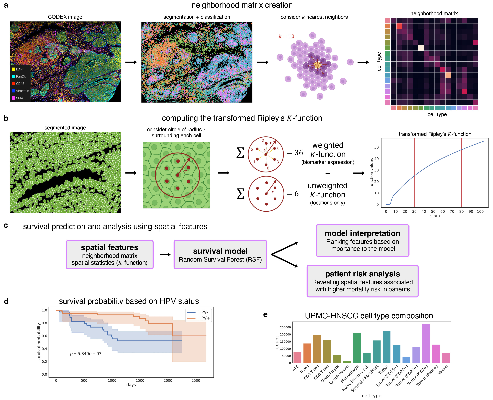

# spatsurv

This repository contains the code for the manuscript Dayao et al. "Deriving spatial features from in situ proteomics imaging to enhance cancer survival analysis".

**Note: This repository is a work in progress, updates will continually be made to add more functionality and examples.** 



## Description
The scripts in this repository can be used to replicate the results found in the manuscript.


## Requirements
This code base uses both R (>=4.1.2) and Python (>=3.10). The following packages are required.

### R
```
SpatialMap (>=4.8.0)
emconnect
spatstat (>=3.0-2)
parallel (>=3.6.2)
```
***The `SpatialMap` and `emconnect` R packages are available through an Enable Medicine Workbench account.***

### Python  
```
numpy (>=1.22.0)
pandas (>=1.3.5)
scipy (>=1.7.3)
scikit-learn (>=1.1.2)
scikit-survival (>=0.18.0)
tqdm (>=4.64.1)
```

## Support
Please create an issue if you have any questions about this code base.

## Authors
This code base is maintained by Monica Dayao (@monicadayao).


